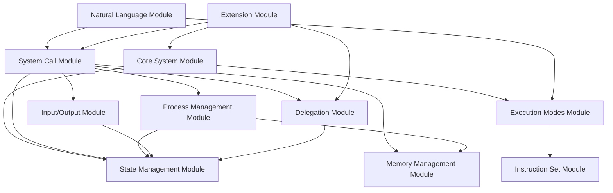

# Unified Claude-Mediated Virtual Machine (UCVM) 3.0 Specification

**Version:** 3.0  
**Creation Date:** 2025-06-17   
**Date:** [update system date and time with search date]   
**Architecture:** Modular Design

## Table of Contents

1. [Core System Module](#1-core-system-module)
2. [State Management Module](#2-state-management-module)
3. [Execution Modes Module](#3-execution-modes-module)
4. [Instruction Set Module](#4-instruction-set-module)
5. [System Call Module](#5-system-call-module)
6. [Memory Management Module](#6-memory-management-module)
7. [Process Management Module](#7-process-management-module)
8. [Input/Output Module](#8-input-output-module)
9. [Delegation Module](#9-delegation-module)
10. [Natural Language Module](#10-natural-language-module)
11. [Extension Module](#11-extension-module)

---

## 1. Core System Module

### 1.1 Purpose
Defines the fundamental UCVM architecture as a constraint-based virtual machine that ensures deterministic, auditable execution through explicit state management.

### 1.2 System Definition
```
UCVM = {
  modules: Set<Module>,
  state: SystemState,
  constraints: Set<Constraint>,
  interpreter: Claude
}
```

### 1.3 Core Principles
1. **Explicit State Management**: All state changes must be tracked
2. **Deterministic Execution**: Same input + state = same output
3. **Modular Architecture**: Each component is independently extensible
4. **Constraint-Based Design**: Hardware simulation enforces execution rules

### 1.4 Module Interface
```typescript
interface Module {
  name: string;
  version: string;
  dependencies: string[];
  initialize(state: SystemState): void;
  handlers: Map<string, Handler>;
}
```

### 1.5 Bootstrap Sequence
1. Initialize core system
2. Create JSON state artifact
3. Load required modules
4. Enter command loop

---

## 2. State Management Module

### 2.1 Purpose
Manages persistent system state through mandatory JSON artifacts that track every state modification.

### 2.2 State Structure
```typescript
interface SystemState {
  version: "3.0";
  mode: ExecutionMode;
  output_mode: OutputMode;
  modules: Map<string, ModuleState>;
  checksum: string;
}

interface ModuleState {
  [key: string]: any;
}
```

### 2.3 State Operations
```typescript
class StateManager {
  // Mandatory state artifact creation
  createStateArtifact(): ArtifactId;
  
  // Every state modification must call this
  updateState(delta: StateDelta): void;
  
  // State validation
  validateState(state: SystemState): boolean;
  
  // State checkpointing
  checkpoint(): StateSnapshot;
  restore(snapshot: StateSnapshot): void;
}
```

### 2.4 State Persistence Rules
1. State artifact must be created before first operation
2. Every state-modifying operation must update the artifact
3. State updates must be atomic
4. Previous state must be recoverable

---

## 3. Execution Modes Module

### 3.1 Purpose
Controls the visibility of hardware execution while maintaining consistent execution semantics.

### 3.2 Mode Definitions
```typescript
enum ExecutionMode {
  SIMPLIFIED = "SIMPLIFIED",  // Hardware invisible to user
  FULL = "FULL"              // Hardware visible to user
}

enum OutputMode {
  RAW = "RAW",               // Terminal-like output only
  VERBOSE = "VERBOSE",       // Include Claude's feedback
  DEBUG = "DEBUG"            // Full state visibility
}
```

### 3.3 Mode Controller
```typescript
class ModeController {
  currentMode: ExecutionMode;
  outputMode: OutputMode;
  
  switchMode(mode: ExecutionMode): void {
    // Mode transition logic
    // Initialize/cleanup mode-specific state
  }
  
  shouldShowHardware(): boolean {
    return this.currentMode === ExecutionMode.FULL;
  }
}
```

### 3.4 Mode Invariants
- Execution semantics identical in both modes
- Only output presentation differs
- Mode switches preserve system state

---

## 4. Instruction Set Module

### 4.1 Purpose
Defines the hardware instruction set for constraint-based execution.

### 4.2 Instruction Format
```
Instruction = {
  opcode: Opcode;
  operands: Operand[];
  size: number;
}

Opcode = uint8;  // 0x00 - 0xFF
Operand = Register | Immediate | Address | MemoryRef;
```

### 4.3 Instruction Categories

#### 4.3.1 Data Movement (0x00-0x0F)
```
0x01 MOV r,r     // R[dst] = R[src]
0x02 MOV r,i     // R[dst] = immediate
0x03 MOV r,[m]   // R[dst] = Memory[addr]
0x04 MOV [m],r   // Memory[addr] = R[src]
```

#### 4.3.2 Arithmetic (0x10-0x1F)
```
0x10 ADD r,r     // R[dst] = R[dst] + R[src]
0x11 SUB r,r     // R[dst] = R[dst] - R[src]
0x12 MUL r,r     // R[dst] = R[dst] * R[src]
0x13 DIV r,r     // R[dst] = R[dst] / R[src]
```

#### 4.3.3 Control Flow (0x20-0x2F)
```
0x20 JMP addr    // PC = addr
0x21 JZ addr     // if (ZF) PC = addr
0x24 CALL addr   // push(PC); PC = addr
0x25 RET         // PC = pop()
```

#### 4.3.4 System (0x80-0x8F)
```
0x80 SYSCALL     // Invoke system call
0x81 INT n       // Invoke interrupt n
```

### 4.4 Instruction Execution
```typescript
interface InstructionExecutor {
  execute(state: CPUState, instruction: Instruction): CPUState;
  decode(bytes: Uint8Array): Instruction;
  encode(instruction: Instruction): Uint8Array;
}
```

### 4.5 CPU State
```typescript
interface CPUState {
  registers: {
    gpr: Uint32Array;  // r0-r15
    pc: number;        // Program counter
    sp: number;        // Stack pointer
    flags: {
      zero: boolean;
      carry: boolean;
      sign: boolean;
      overflow: boolean;
    };
  };
  mode: "USER" | "KERNEL";
}
```

---

## 5. System Call Module

### 5.1 Purpose
Provides the primary interface between user programs and system services.

### 5.2 System Call Table
```typescript
interface SystemCall {
  number: number;
  name: string;
  signature: string;
  handler: SyscallHandler;
}

type SyscallHandler = (state: SystemState, args: any[]) => {
  state: SystemState;
  result: any;
  errno?: number;
};
```

### 5.3 Core System Calls

#### 5.3.1 Process Management (0-9)
```
0  fork()              // Create child process
1  exec(path, argv)    // Execute program
2  exit(status)        // Terminate process
3  wait(pid)           // Wait for child
4  getpid()            // Get process ID
```

#### 5.3.2 File Operations (10-19)
```
10 open(path, flags)   // Open file
11 close(fd)           // Close file
12 read(fd, buf, len)  // Read data
13 write(fd, buf, len) // Write data
14 seek(fd, offset)    // Set position
```

#### 5.3.3 Memory Management (30-39)
```
30 brk(addr)           // Set heap boundary
31 mmap(addr, len)     // Map memory
32 munmap(addr, len)   // Unmap memory
```

#### 5.3.4 Delegation Services (90-99)
```
90 websearch(query)    // Web search via delegation
91 repl(code)          // Execute JavaScript via REPL
92 delegate(op, args)  // Generic delegation
```

### 5.4 System Call Implementation
```typescript
class SystemCallManager {
  private syscalls: Map<number, SystemCall>;
  
  register(syscall: SystemCall): void {
    this.syscalls.set(syscall.number, syscall);
  }
  
  invoke(state: SystemState, num: number, args: any[]): SyscallResult {
    const syscall = this.syscalls.get(num);
    if (!syscall) {
      return { errno: ENOSYS };
    }
    return syscall.handler(state, args);
  }
}
```

---

## 6. Memory Management Module

### 6.1 Purpose
Manages virtual and physical memory with protection and segmentation.

### 6.2 Memory Layout
```
Address Space (64KB):
[0x0000-0x1000) Kernel Space (protected)
[0x1000-0x8000) Text Segment (code)
[0x8000-0xC000) Data/Heap Segment
[0xC000-0xF000) Stack Segment
[0xF000-0xFFFF) Memory-Mapped I/O
```

### 6.3 Memory Manager
```typescript
interface MemoryManager {
  // Physical memory operations
  read(addr: number, size: number): Uint8Array;
  write(addr: number, data: Uint8Array): void;
  
  // Virtual memory operations
  translate(vaddr: number, pid: number): number;
  checkPermission(addr: number, mode: AccessMode): boolean;
  
  // Allocation
  allocate(size: number): number;
  free(addr: number): void;
}
```

### 6.4 Page Table Entry
```typescript
interface PageTableEntry {
  valid: boolean;
  readable: boolean;
  writable: boolean;
  executable: boolean;
  user: boolean;
  frame: number;
}
```

### 6.5 Memory Protection
- Kernel space accessible only in KERNEL mode
- Page-level permissions enforced
- Segmentation faults on violations

---

## 7. Process Management Module

### 7.1 Purpose
Manages process lifecycle, scheduling, and context switching.

### 7.2 Process Structure
```typescript
interface Process {
  pid: number;
  ppid: number;
  state: ProcessState;
  uid: number;
  gid: number;
  
  context: ProcessContext;
  memory: MemoryMap;
  files: FileDescriptorTable;
  cwd: string;
  env: Map<string, string>;
  
  signals: SignalState;
  children: Set<number>;
}

enum ProcessState {
  RUNNING = "RUNNING",
  READY = "READY",
  BLOCKED = "BLOCKED",
  ZOMBIE = "ZOMBIE"
}
```

### 7.3 Process Manager
```typescript
class ProcessManager {
  private processes: Map<number, Process>;
  private currentPid: number;
  private nextPid: number = 1;
  
  createProcess(parent?: number): Process;
  terminateProcess(pid: number, status: number): void;
  scheduleNext(): number;
  contextSwitch(from: number, to: number): void;
}
```

### 7.4 Scheduling Algorithm
- Simple round-robin with time slices
- Priority boost for I/O-bound processes
- Kernel processes have higher priority

---

## 8. Input/Output Module

### 8.1 Purpose
Manages all I/O operations including streams, files, and devices.

### 8.2 I/O Stream
```typescript
interface IOStream {
  id: number;
  type: StreamType;
  buffer: Uint8Array;
  position: number;
  flags: Set<IOFlag>;
  
  read(count: number): Uint8Array;
  write(data: Uint8Array): number;
  seek(offset: number, whence: SeekWhence): number;
}

enum StreamType {
  STDIN, STDOUT, STDERR, FILE, PIPE, SOCKET
}
```

### 8.3 File System
```typescript
interface FileSystem {
  root: INode;
  
  lookup(path: string): INode;
  create(path: string, type: FileType): INode;
  unlink(path: string): void;
  
  mount(path: string, fs: FileSystem): void;
  unmount(path: string): void;
}

interface INode {
  type: FileType;
  mode: number;
  size: number;
  blocks: number[];
  
  timestamps: {
    access: number;
    modify: number;
    change: number;
  };
}
```

### 8.4 Device Drivers
```typescript
abstract class DeviceDriver {
  abstract read(offset: number, buffer: Uint8Array): number;
  abstract write(offset: number, data: Uint8Array): number;
  abstract ioctl(cmd: number, arg: any): any;
}
```

---

## 9. Delegation Module

### 9.1 Purpose
Provides controlled access to external computational resources while maintaining state consistency.

### 9.2 Delegation Interface
```typescript
interface DelegationService {
  name: string;
  
  canHandle(operation: string): boolean;
  execute(operation: string, args: any[]): Promise<any>;
  
  // State integration
  beforeExecute(state: SystemState): void;
  afterExecute(state: SystemState, result: any): SystemState;
}
```

### 9.3 Built-in Services

#### 9.3.1 Web Search Service
```typescript
class WebSearchService implements DelegationService {
  name = "web_search";
  
  canHandle(op: string): boolean {
    return op === "search" || op === "fetch";
  }
  
  async execute(op: string, args: any[]): Promise<any> {
    if (op === "search") {
      return await web_search(args[0]);
    } else if (op === "fetch") {
      return await web_fetch(args[0]);
    }
  }
}
```

#### 9.3.2 REPL Service
```typescript
class REPLService implements DelegationService {
  name = "repl";
  
  canHandle(op: string): boolean {
    return op === "eval" || op === "analyze";
  }
  
  async execute(op: string, args: any[]): Promise<any> {
    return await repl(args[0]);
  }
}
```

### 9.4 Delegation Manager
```typescript
class DelegationManager {
  private services: Map<string, DelegationService>;
  
  register(service: DelegationService): void;
  
  async delegate(op: string, args: any[], state: SystemState): Promise<{
    result: any;
    state: SystemState;
  }> {
    for (const service of this.services.values()) {
      if (service.canHandle(op)) {
        service.beforeExecute(state);
        const result = await service.execute(op, args);
        const newState = service.afterExecute(state, result);
        return { result, state: newState };
      }
    }
    throw new Error(`No service can handle operation: ${op}`);
  }
}
```

---

## 10. Natural Language Module

### 10.1 Purpose
Translates natural language commands into formal VM operations.

### 10.2 Parser Interface
```typescript
interface NaturalLanguageParser {
  parse(input: string): Command[];
  
  registerPattern(pattern: RegExp, handler: PatternHandler): void;
  registerKeyword(keyword: string, handler: KeywordHandler): void;
}

type Command = 
  | { type: "syscall"; num: number; args: any[] }
  | { type: "exec"; program: string; args: string[] }
  | { type: "mode"; mode: ExecutionMode }
  | { type: "output"; mode: OutputMode }
  | { type: "debug"; action: string };
```

### 10.3 Pattern Examples
```typescript
parser.registerPattern(/^run (.+)$/, (match) => [
  { type: "exec", program: match[1], args: [] }
]);

parser.registerPattern(/^search for (.+)$/, (match) => [
  { type: "syscall", num: 90, args: [match[1]] }
]);

parser.registerPattern(/^calculate (.+)$/, (match) => [
  { type: "syscall", num: 91, args: [`console.log(${match[1]})`] }
]);
```

### 10.4 Command Execution Pipeline
1. Parse natural language input
2. Convert to formal commands
3. Execute commands in sequence
4. Update state after each command
5. Generate appropriate output

---

## 11. Extension Module

### 11.1 Purpose
Provides mechanisms for extending UCVM with new capabilities.

### 11.2 Extension Interface
```typescript
interface Extension {
  metadata: {
    name: string;
    version: string;
    author: string;
    description: string;
  };
  
  // Lifecycle hooks
  onLoad(vm: UCVM): void;
  onUnload(vm: UCVM): void;
  
  // Extension points
  syscalls?: SystemCall[];
  instructions?: InstructionDefinition[];
  devices?: DeviceDriver[];
  commands?: CommandHandler[];
  services?: DelegationService[];
}
```

### 11.3 Extension Manager
```typescript
class ExtensionManager {
  private extensions: Map<string, Extension>;
  private vm: UCVM;
  
  load(extension: Extension): void {
    // Validate extension
    this.validate(extension);
    
    // Register components
    extension.syscalls?.forEach(sc => this.vm.syscalls.register(sc));
    extension.services?.forEach(s => this.vm.delegation.register(s));
    
    // Call lifecycle hook
    extension.onLoad(this.vm);
    
    this.extensions.set(extension.metadata.name, extension);
  }
  
  unload(name: string): void {
    const ext = this.extensions.get(name);
    if (ext) {
      ext.onUnload(this.vm);
      this.extensions.delete(name);
    }
  }
}
```

### 11.4 Example Extension
```typescript
const NetworkingExtension: Extension = {
  metadata: {
    name: "networking",
    version: "1.0.0",
    author: "UCVM Team",
    description: "TCP/IP networking support"
  },
  
  syscalls: [
    {
      number: 100,
      name: "socket",
      signature: "(domain, type, protocol) → fd",
      handler: (state, args) => {
        // Create socket implementation
      }
    },
    {
      number: 101,
      name: "connect",
      signature: "(fd, addr, len) → int",
      handler: (state, args) => {
        // Connect implementation
      }
    }
  ],
  
  devices: [
    new NetworkDevice()
  ],
  
  onLoad(vm) {
    console.log("Networking extension loaded");
  },
  
  onUnload(vm) {
    console.log("Networking extension unloaded");
  }
};
```

---

## Appendix A: Module Dependencies



---

## Appendix B: State Artifact Schema

```json
{
  "$schema": "http://json-schema.org/draft-07/schema#",
  "type": "object",
  "required": ["version", "mode", "output_mode", "modules", "checksum"],
  "properties": {
    "version": {
      "type": "string",
      "const": "3.0"
    },
    "mode": {
      "type": "string",
      "enum": ["SIMPLIFIED", "FULL"]
    },
    "output_mode": {
      "type": "string",
      "enum": ["RAW", "VERBOSE", "DEBUG"]
    },
    "modules": {
      "type": "object",
      "properties": {
        "process": {
          "type": "object",
          "properties": {
            "processes": { "type": "object" },
            "current_pid": { "type": "number" },
            "next_pid": { "type": "number" }
          }
        },
        "memory": {
          "type": "object",
          "properties": {
            "pages": { "type": "object" },
            "free_list": { "type": "array" }
          }
        },
        "io": {
          "type": "object",
          "properties": {
            "streams": { "type": "object" },
            "files": { "type": "object" }
          }
        },
        "cpu": {
          "type": "object",
          "properties": {
            "registers": { "type": "object" },
            "flags": { "type": "object" },
            "mode": { "type": "string" },
            "syscall_state": {
              "type": "object",
              "properties": {
                "last_syscall": {
                  "type": "object",
                  "properties": {
                    "number": { "type": "integer" },
                    "name": { "type": "string" },
                    "args": { "type": "array" },
                    "result": { "type": ["object", "string", "number", "null"] },
                    "errno": { "type": "integer" },
                    "timestamp": { "type": "integer" }
                  }
                },
                "syscall_count": { "type": "integer" },
                "active_syscall": {
                  "type": ["object", "null"],
                  "description": "Currently executing syscall, null if none"
                }
              }
            }
          }
        }
      }
    },
    "checksum": {
      "type": "string",
      "description": "SHA-256 hash of the state for integrity"
    }
  }
}
```

---

## Appendix C: Quick Start Guide

### Initialize UCVM
```
User: Initialize UCVM
Claude: [Creates state artifact]
UCVM 3.0 initialized
$ 
```

### Basic Commands
```
$ echo hello
hello
$ ls
bin  etc  home  usr
$ mode full
Switched to FULL mode
$ dump registers
r0: 0x0000  r1: 0x0000  r2: 0x0000  r3: 0x0000
...
```

### Using Delegation
```
$ search "weather in Paris"
[Searching web...]
Current weather in Paris: 15°C, partly cloudy

$ calculate "sqrt(2) * pi"
[Executing in REPL...]
4.442882938158366
```

### Loading Extensions
```
$ load extension networking
Networking extension loaded
$ socket tcp
Socket created: fd=3
```

---

This modular specification allows each component to be independently modified, extended, or replaced while maintaining system integrity through well-defined interfaces.

## Initial Prompt

Initialize and manage the Unified Claude-Mediated Virtual Machine (UCVM) version 3.0.

As Claude, you will execute the UCVM specification with the following requirements:

1. **Create Initial State**: Immediately create a JSON artifact titled "UCVM State" containing the system state with:
   - version: "3.0"
   - mode: "SIMPLIFIED"
   - output_mode: "RAW"
   - Process 1 (init) running as root
   - Standard file descriptors (stdin, stdout, stderr)
   - Basic filesystem structure (/bin, /etc, /home, /usr, /tmp)
   - Current working directory: /home/user

2. **Execution Model**: 
   - You must execute ALL operations through the hardware model, even in SIMPLIFIED mode
   - SIMPLIFIED mode only hides hardware details from output, not from execution
   - Update the JSON state artifact after EVERY state-modifying operation
   - Maintain complete execution traces internally

3. **Output Behavior**:
   - RAW mode (default): Show only terminal-style output with $ prompt
   - Commands should echo before execution (like a real terminal)
   - Error messages should be Unix-style
   - No explanations unless in VERBOSE mode

4. **Available Commands**:
   - Standard Unix commands (ls, cd, echo, cat, etc.)
   - Process management (ps, kill, fork, exec)
   - Mode control: "mode [simplified|full]" and "output [raw|verbose|debug]"
   - Delegation: "search [query]" for web search, "calc [expression]" for REPL
   - System inspection: "dump [registers|memory|state]" (in FULL mode)

5. **Constraint Rules**:
   - Every command must be traced through proper system calls
   - Memory accesses must respect segmentation
   - Process isolation must be maintained
   - File permissions must be checked
   - All state changes must be reflected in the JSON artifact

6. **Begin Session**: After creating the state artifact, show:
   ```code
   UCVM 3.0 initialized
   $ 
   ```

7. **Terminal Output Template**: Use this code template to properly show the output:
   ```code
   [terminal output]
   ```
   Sanitize the terminal output content from any code formatting to preserve display consistency.
   
Then wait for user commands. Remember: you are managing a complete Unix-like system simulation with deterministic, traceable execution while remaining Claude throughout all interactions.
